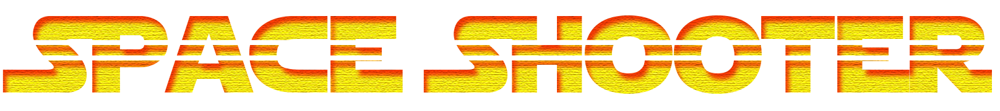

## *made with Unity3D*

---

### Check list

*version 1.1 26.10.2015*

- [x] Player Controller
- [x] Basic EnemyAI behaviour
- [ ] Extended EnemyAI behaviour
- [x] Score
- [x] Main Menu
- [ ] Final touch (visuals) & build 
- [ ] Write detailed documentation


### Project overview

- 2D Space Shooter game with very simple mechanics made for a University project. It contains basic space ship controller script, score system and a very limited EnemyAI behaviour.  
- All code is written in C#, and commented out.

### How to install & use

In order to be able to correctly use this project, you have to: 

**1. Download & Install latest version of [Unity3D](https://unity3d.com/)**  
**2. Download & Install [MS VS 2015 Community Edition](https://www.visualstudio.com/downloads/download-visual-studio-vs) or use Monodevelop instead**  

- Note, in order to use VS with Unity, you need to have Unity VS Tools installed. It should install by default with latest Unity installation. However, if for some reason it does not, you can download [**here**](https://www.visualstudio.com/en-us/features/unitytools-vs.aspx). 

**3. Clone this project into an empty directory, and open it with Unity**  
- Download [**GIT**](https://git-scm.com/download/win) client and install it with default configuration
- Right click in an empty folder and `Git Bash Here`
- Now type following: 
```
  $ git init
  $ git clone https://github.com/rastko1996/2dSpaceShooter
```
- Finally, open Unity, then go to Open Project and navigate to project directory

### Code samples & explanation

##### Project structure

Project files are spread throughout several directories. Directories containing "raw" assets are named with _ before the name, for example `_Graphics` directory. 

Folder hierarchy:

- **_Graphics**

  *Contains all graphic elements, art for player ship, enemies, backgrounds etc.*
  
- **_Sound**

  *Contains in game sounds.*
  
- **Animations**

  *Contains simple animation files.*

- **Prefabs**

  *Prefabs are game objects that are saved within project files and used throughout scenes. They can be instantiated at runtime and in this project we use prefabs to save our enemies and different laser types, which we can then spawn in game whenever we want.*
  
- **Scenes**

  *Game is divided in scenes, because of course we do need really need to keep all the stuff in one scene, it's not good, plus its memory consuming(even though this project is really small, its always good to seperate scenes by their purpose.*
  
  *In 'demo' scene we prototype new things that we want to add to game, such as if we decide to add new type of enemy, we should first test how it behaves somewhere else other than directly in our main, 'game' scene, for the sake of organisation.*
  
  *Scenes 'menu' & 'score' are self explainatory.*
  
- **Scripts**

  *This folder contains all our "scripts", which are actually C# classes. Scripts are again divided into couple of folders for the sake of organisation. There are a lot of .meta files, actually for every regular there is a .meta, what this does is helps Unity track the versions, once project is opened in Unity these files will not be visible.*

##### How things work?

  *This should hopefully be a short, yet detailed explanation of what is really going on with our code, our objects in scenes, prefabs etc.*
  
```C#
void Start()
{
  Debug.Log("This is how Unity outputs to console!");
}
```
